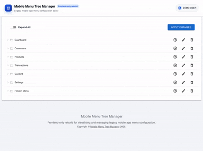
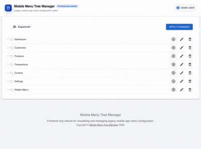
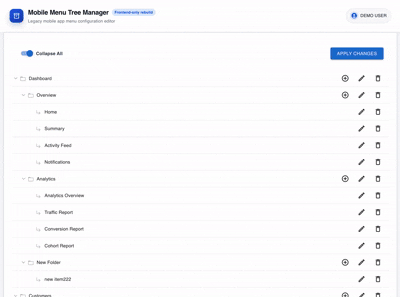
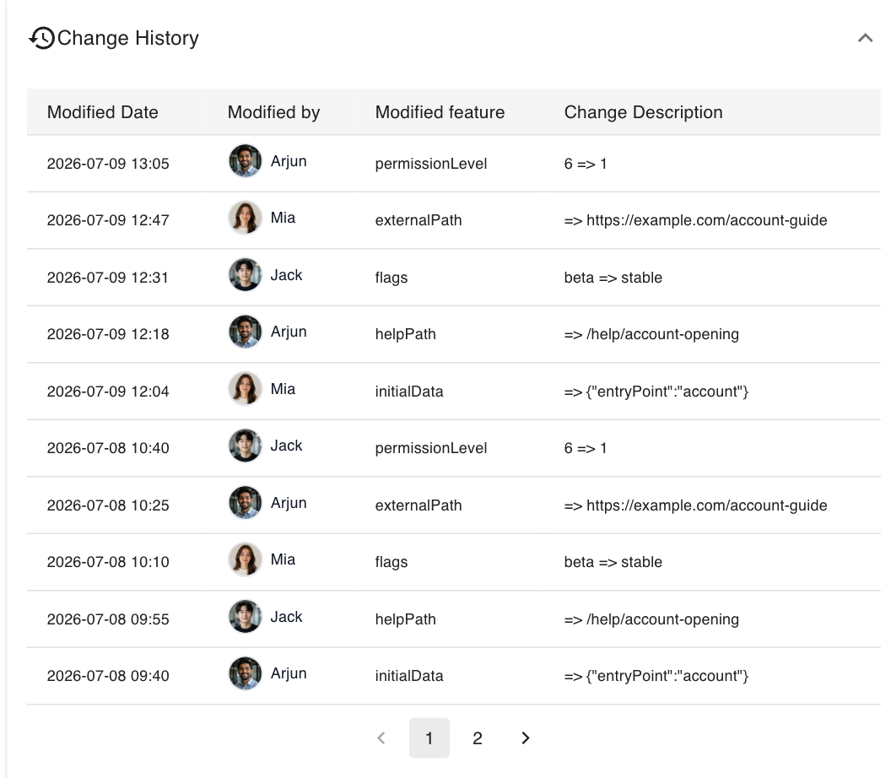
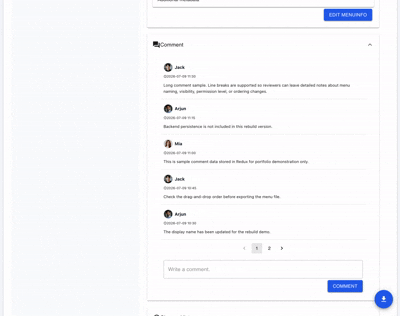

# Mobile Menu Tree Manager

A frontend-only rebuild of an internal mobile app menu management tool.

This project visualizes legacy mobile app menu configuration data as a tree structure and provides an admin-style interface for inspecting, editing, reordering, commenting, and exporting menu data.

> This repository is a portfolio rebuild version.  
> The original internal project included backend persistence, database-backed history, and company-specific menu data.  
> This public version uses anonymized mock data and focuses on frontend UI/UX, state management, and data transformation logic.

</br>

---

</br>

## Overview

This project focuses on converting legacy menu configuration data into a visual, editable admin interface.

In the original workflow, menu configuration was managed through structured data and internal tools. This rebuild focuses on improving the visibility and editability of menu data by providing:

- Tree-based menu visualization
- Menu detail inspection
- Menu property editing
- Drag-and-drop menu reordering
- Menu comments and change history
- JSON export from the current frontend state

The goal of this project is to demonstrate how complex legacy configuration data can be transformed into a more maintainable and user-friendly admin interface.
</br>

---

</br>

## Background

The original internal tool was created to reduce the risk of manually editing mobile app menu configuration files.
Legacy menu configuration was difficult to review directly because the data was stored in a deeply nested structure.

```txt
  "menus": [
    ["dashboard","","Dashboard","icon_menu_dashboard", 1,1,0,"","","", "","","","","",
      [
        [".overview", "-", "Overview","",1,1,0,"","","","", "","","","",[
            [ "home","dashboard/home","Home","",1,0,0,"","","Home","", "","Home","","",""],
            [ "summary","dashboard/summary","Summary", "",1,0,1,"","","Summary","","","Summary","","",""],
            [ "activity", "dashboard/activity", "Activity Feed","",1,0, 1,"","","Activity","", "","Activity Feed","","",""],
            [ "notifications","dashboard/notifications", "Notifications","", 1,0,1,"","","Alerts","", "","Notifications","", "", ""]
          ]
        ],
        [ ".analytics","-", "Analytics","",1,1,0,"","","","","","","", "",
....
```
> full version of mock data could be find src/assets/menuInfo.mock.json

</br>
Manual configuration updates caused several practical issues:

- The array-based format made the menu hierarchy difficult to understand.
- Change history was not clearly managed.
- Manual menu additions and deletions were error-prone.
- Configuration mistakes could break the app or prevent it from launching.
- Multiple team members could end up editing different versions of the same menu file.
- There was a risk of accidentally modifying or deleting menu items added by others.


To make the project publicly shareable, all company-specific data was replaced with anonymized mock data.
<p align="center">
  
</p>


</br>

---

</br>

## Project Scope
This repository is a **Rebuild Lite** version of the original internal project.
</br>

### Included in this rebuild

- Frontend menu tree visualization
- Menu detail table
- Menu property editing
- Drag-and-drop tree editing
- Redux-based session state
- Demo comments
- Demo change history
- JSON export
- Anonymized mock menu data
</br>

### Not included in this rebuild

- Original backend server
- Original database
- Authentication / authorization
- Real company menu configuration (.json data )
- Server-side persistence
- Production deployment workflow

In the original internal version, menu changes were persisted through a spring boot backend server and mysql database.  
In this public rebuild, changes are stored only in frontend state during the current session.

</br>

---

</br>

## Tech Stack

</br>

### Frontend

<p>
  
  
  
  
  
</p>

</br>

### Data

- Anonymized JSON menu data
- Redux state for session-only editing
- JSON export for the edited menu tree

</br>

---

</br>

## Main Features

</br>

### 1. Menu Tree Visualization

The app parses anonymized legacy menu configuration data and renders it as an interactive tree view.
Users can browse, expand, collapse, and search menu items.

<p align="center">
  
</p>

</br>

---

</br>

### 2. Menu Detail View & Editing Menu Detail

When a menu item is selected, its properties are displayed in a structured detail table.
Displayed properties include:

- Menu ID
- Screen path
- Menu name
- Icon
- Visibility flag
- Menu type
- Permission level
- Search name
- Metadata

Tooltip descriptions are used to make technical menu properties easier to understand.

Users can modify menu properties from the detail panel.
When a property is changed, change history automatically stacked so users can track change history.
> The edit flow is designed to simulate the original internal workflow while keeping this rebuild frontend-only.

<p align="center">
  
</p>

</br>

---

</br>

### 3. Drag-and-Drop Tree Editing

The edit page supports drag-and-drop menu reordering.

This allows users to preview changes to the menu hierarchy and item order.

> In this rebuild version, drag-and-drop changes are for frontend demonstration purposes only and are not persisted to a backend database.

<p align="center">
  
</p>

</br>

---

</br>

### 4. Menu Editing (Add & Delete)

The edit page allows users to add new menu items and delete existing ones from the menu tree.

Users can create a new menu item by entering a menu name and selecting whether the item can contain child menus. Existing menu items can also be deleted directly from the tree. If the selected item has child menus, the UI displays a warning that all nested menu items will be deleted as well.

This feature demonstrates a safer way to manage menu structure changes through UI interactions instead of manually editing the raw configuration file.

> In this rebuild version, add/delete changes are handled in frontend state for demonstration purposes only and are not persisted to a backend database.

<table align="center">
  <tr>
    <td align="center">
      
      <br />
      <sub><b>Add New Menu</b></sub>
    </td>
    <td align="center">
      
      <br />
      <sub><b>Delete Menu</b></sub>
    </td>
  </tr>
</table>

</br>

---

</br>

### 5. Change History Demo

The app includes a demo change history panel.

When menu properties are updated, changed fields can be recorded as history entries with:

- Modified date
- Modified by
- Changed property
- Before value
- After value

This demonstrates how the original internal tool tracked menu changes.


<table align="center">
  <tr>
    <td align="center">
      
      <br />
      <sub><b>History Section</b></sub>
    </td>
    <td align="center">
      
      <br />
      <sub><b>History added automatically</b></sub>
    </td>
  </tr>
</table>

</br>

---

</br>

### 6. Comment Demo

The comment panel demonstrates a review workflow for menu items.

Users can add comments to a selected menu item during the current session.

Comments are stored in Redux state and reset after refresh.

<p align="center">
  
</p>

</br>

---

</br>

### 7. JSON Export

The current Redux menu state can be exported as a JSON file.

The export function converts the edited tree data back into the legacy menu configuration format.

<p align="center">
  
</p>

</br>

---

</br>

## Parser Logic

The original menu configuration uses an indexed array-based structure, which is difficult to read and edit directly.
This rebuild includes parser utilities to convert the raw configuration into UI-friendly data structures.

</br></br>

### Main Menu Parser

Converts the raw menu configuration into a nested tree object used by the main page.
This parsed structure is used for:

- Rendering the menu tree
- Displaying selected menu details
- Updating menu properties
- Exporting the current menu state

</br></br>

### Edit Menu Parser

Converts the raw menu configuration into a flat `NodeModel` array used by the drag-and-drop edit page.

This structure is used for:

- Drag-and-drop reordering
- Parent-child relationship handling
- Menu add/delete interactions

</br></br>

### Export Parser

Converts the current Redux menu state back into the original exportable JSON structure.

## Data Flow

```txt
menuInfo.mock.json
        ↓
menu parser
        ↓
Redux state
        ↓
Tree / Detail / Edit UI
        ↓
Updated frontend state
        ↓
JSON export
```

</br></br>

## Live Demo

You can try the deployed demo here: Coming soon

</br></br>

## Local Setup

```bash

git clone https://github.com/IAGREEBUT/mobile-menu-tree-manager.git

cd mobile-menu-tree-manager

npm install

npm start
```

The app will run at: http://localhost:3000
